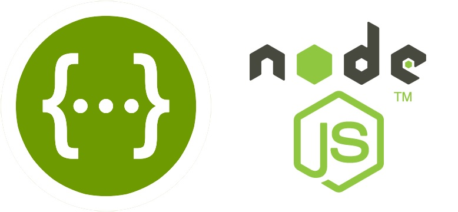
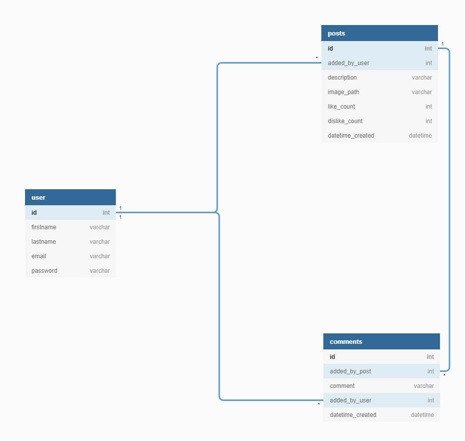

# Simple-nodejs-app

This is a RESTFUL API for a blog build using nodejs. It is a test and has no specific functions

## NPM Packages Used

* Swagger
* [CORS](https://expressjs.com/en/resources/middleware/cors.html)
* [Moestif](https://www.moesif.com/docs/)
* [express](https://expressjs.com/)
* [Swagger](https://swagger.io/tools/swagger-ui/)

## Useful Links

* [API home route](https://simple-node-backend-app.herokuapp.com/)
* [API docs](https://simple-node-backend-app.herokuapp.com/api-docs/)

## Notes

* The API docs allow users test the API by clicking the 'Try it out' button.

## SQL Database Schema

## Further Improvements

* validate data using express-validator